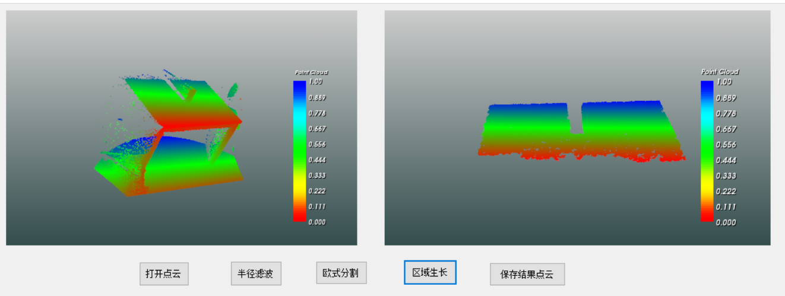

# PclCSharp

## 简介

PclCSharp是**Pcl1.8.1**点云库的.Net包装。该库能使用户在C#、VB.net等基于.NET框架的语言中使用。该库主要集成了pcl库的点云处理功能，并没有封装点云的显示功能。因为在pcl中，点云的显示是靠vtk实现的，而vtk有C#的版本。用户可以使用vtk可视化点云，使用该库对点云进行处理。目前该库仅支持Windows X64平台。

# 1 使用方法

本库主要封装了四个Dll，分别是PointCloudSharpDll、PclCSharp、PointCloudDll和PclDll。其中前两个是用C#封装的Dll，它们是对后两个dll的包装。它们之间具体的依赖关系见下图。

在实际使用时，只需要在.net中引用PointCloudSharpDll、PclCSharp这两个dll即可。但是需要把其他两个dll以及这两个dll依赖的所有dll全部放在exe所在目录。除此之外，你也可以放在system32目录，或者放在环境变量中指定的文件夹中也可以。不过建议放在exe所在目录。**依赖的dll全部放在depend/x64目录中**。

切记，**下图所列的所有dll必须一个不漏的和PointCloudSharpDll、PclCSharp这两个dll放在一起**，不然会报System.DllNotFoundException:“无法加载 DLL这个错误。

还有一个点需要注意，对于pcl_common_release这个dll，它依赖的都是系统级的dll和C++运行时的dll。对于系统级的dll，只要是正常的window10系统（笔者是在win10上封装的，所以得是win10系统）都会在system32目录中包含相应的dll，所以无需额外添加。至于C++的dll，大部分安装了编程软件的电脑也都会包含，所以也无需额外添加。

# 2 PointCloudSharp命名空间

PointCloudSharp中封装了pcl中存储点云的基本数据结构，包括`pcl::PointCloud<pcl::PointXYZ>`、`vector<pcl::PointIndices>`和`pcl::PointCloud<pcl::Normal>`等。目前封装好的只有`pcl::PointCloud<pcl::PointXYZ>`、`vector<pcl::PointIndices>`这两类，其他的数据结构后续逐步封装。**具体见doc目录中的函数说明**。

# 3 PclCSharp命名空间

该命名空间中包含了pcl中点云处理的算法，暂时封装了Io、Filter、Segmentation、SampleConsensus和Util五个静态类，每个类大体对应着pcl的一个模块，后续会慢慢增加其他模块。各个类之间的依赖关系见下图。具体见doc目录中的函数说明。

# 4 示例

在demo目录中，提供了C#语言的示例。该例子包含显示点云、区域生长、半径滤波、欧式分割等功能。比如在区域生长示例中，使用该库对桌子点云进行区域生长，结果见下图。具体函数实现请见demo目录

