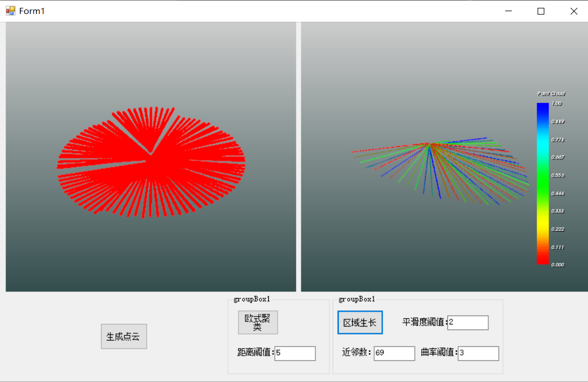

​                                                                                                    

​                                                  

- [重要更新](#重要更新)
- [1 简介](#1-简介)
- [2 使用方法](#2-使用方法)
- [3 命名空间介绍](#3-命名空间介绍)
  - [3.1 PointCloudSharp命名空间](#31-pointcloudsharp命名空间)
  - [3.2 PclCSharp命名空间](#32-pclcsharp命名空间)
- [4 函数demo](#4-函数demo)
  - [4.1 IoDemo](#41-iodemo)
  - [4.2 FilterDemo](#42-filterdemo)
## 重要更新

2024929：上班之后很久没有更新这个库了，但我发现有很多人在使用这个库。很开心，算是为开源事业做了一点贡献。
唯一让人不爽的是，我发现有很多人使用我这个开源库去赚钱，某个教育机构（我就不点名了）直接使用我的库去进行商业活动，然后我还被别人拿着这个库的demo指责我抄袭，真是活久见。
我不能保证所有人都能尊重我的版权，所以我现在对license做了修改，改成了GNU协议。这个协议我只说重要的几点：
1.如果你是纯粹从技术的角度来学习这个库，我很欢迎，你可以任意修改这个代码，并且可以给这个库进行贡献
2.如果你需要使用这个库赚钱，那么你依赖这个库的软件必须也使用这个GPL协议，也就是必须开源，同时，你需要在你的版权文件中声明这个库的贡献，这是这个协议最重要的一点！

最后，给自己的闲鱼店铺打个广告：叔均的软件杂货铺。偶尔会接接给人配置pcl或者opencv的小单，赚点外快。

2022629，昨天有个用户使用了我的库，但报“未加载PclDLL”这个错误，经过远程指导，终于发现是因为自己在Io模块中增添了VTK相关的函数，但是没在依赖中添加VTK相关的dll。目前这个问题已解决。VTK相关的Dll已经放在depend/x64目录中。

20221214，总算忙完论文的事了，而且盲审也没抽中，很开心，后面就等着答辩毕业了。后续我会再逐渐完善这个库，鉴于本人目前的编程能力，并没有使用一些设计模式去构建整个工程，所以该库的扩展性和复用性不是那么好。目前已经暴露出一个很明显的问题了，有用户想要对PointXYZRGB的数据结构做处理，但该库目前只支持PointXYZ数据结构，若要支持PointXYZRGB或者其他类型的结构，必须得重复封装算法，代码的复用性是一点都没体现啊（手动滑稽）。这个问题只有等我把设计模式啥的学好了再来重构工程把，如果有想处理PointXYZRGB等数据结构的，就只有下载我的源码，然后仿照我的思路自己去构建了。

顺带说一下，今天更新了一下分割模块的demo，点云数据是使用activiz生成的圆形点云，主要演示了基于欧式聚类的点云分割算法还有基于区域生长的点云分割算法。

## 1 简介

**（因为境内访问GitHub网络会不稳定，所以可能无法看到图片。如果出现这种情况，请多刷新几次网页，还是不行的话，只能挂个VPN或者换个时间段访问。）**

对于3D点云处理来说，Pcl点云库必不可少。如果说OpenCV是2D信息获取与处理的结晶，那么Pcl就在3D信息获取与处理上具有同等地位。但不同于opencv拥有众多.NET包装，如OpencvSharp、emgucv等，**目前并没有可靠的Pcl的.NET包装**（PclSharp已经好几年没有维护，而现行版本又bug太多。），这不利于.NET用户开发3D点云的相关应用。

为解决这个问题，笔者开发了Pcl点云库的.NET包装：PclCSharp。该库封装的是**Pcl1.8.1版本**，主要集成了pcl库的点云处理功能，**但没有封装点云可视化功能**。因为在pcl中，点云可视化是靠vtk实现的，而vtk有C#的版本。**用户可以使用vtk可视化点云，使用该库对点云进行处理**。目前该库仅支持Windows10 X64平台。

## 2 使用方法

**先给本仓库点个 star，给我一个继续创作的动力**，该库绝对值你一个 star。如果在使用过程中发现任何bug，可以邮箱联系我2237380450@qq.com，我会一直维护该库。

本库是在**VS2017、.NET Framework4.6.1**框架中进行封装的，主要封装了四个Dll，分别是PointCloudSharpDll、PclCSharp、PointCloudDll和PclDll。其中**前两个是用C#封装的Dll，它们是对后两个dll的包装**。它们之间具体的依赖关系见下图。

在实际使用时，只需要在.net中**引用PointCloudSharpDll、PclCSharp这两个dll即可**。但是需要把其他两个dll以及这两个dll依赖的所有dll全部放在exe所在目录。当然，你也可以放在system32目录，或者放在环境变量指定的文件夹。笔者建议放在exe所在目录中。**依赖的dll全部放在depend/x64目录中**。

切记，**下图所列的所有dll必须一个不漏的和PointCloudSharpDll、PclCSharp这两个dll放在一起**，不然会报System.DllNotFoundException:“无法加载 DLL这个错误。

还有一点需要注意，对于pcl_common_release这个dll，它依赖的都是系统级的dll和C++运行时的dll。对于系统级的dll，只要是正常的window10系统（笔者是在win10上封装的，所以得是win10系统）都会在system32目录中包含相应的dll，所以无需额外添加。至于C++的dll，大部分安装了编程软件的电脑也都会包含，所以也无需额外添加。

**用户只需将bin目录下的PointCloudSharpDll、PclCSharp、PointCloudDll和PclDll四个dll和depend/x64目录中的所有dll一起放在exe所在路径中即可使用**。

## 3 命名空间介绍

### 3.1 PointCloudSharp命名空间

PointCloudSharp中封装了**该库的数据结构**。目前将`pcl::PointCloud<pcl::PointXYZ>`、`vector<pcl::PointIndices>`这两类数据结构进行了封装，对应C#的类为`PointCloudXYZ`、`PointIndices`。其他的数据结构后续逐步封装。**具体见doc目录中的函数说明**。

### 3.2 PclCSharp命名空间

该命名空间中包含了pcl中点云处理的算法，暂时封装了Io、Filter、Segmentation、SampleConsensus和Util五个静态类，每个类大体对应着pcl的一个模块，后续会慢慢增加其他模块。各个类之间的关系见下图。**具体见doc目录中的函数说明**。

## 4 函数demo

在demo目录中，提供了C#语言的示例。该demo包含各个模块的示例程序。**具体函数实现请见demo目录**。**相关的点云文件可在source目录中找到**。

### 4.1 IoDemo

该demo主要是关于Io模块的示例程序，在该demo中，笔者演示了**如何加载pcd、ply、obj、stl格式的文件**，并使用vtk进行可视化，除此之外，**还可使用该demo将加载的文件保存为pcd或者ply格式的文件**。结果见下图。

### 4.2 FilterDemo

该demo主要是关于Filter模块的示例程序。在该demo中，笔者演示了如何对**桌子文件(table_scene_lms400.pcd)**进行**体素下采样、均匀下采样、半径滤波、统计滤波、直通滤波**等，并使用vtk进行可视化。

桌子点云图见下

对其进行体素下采样，采样参数设置为0.08，结果见下。可以看到桌子点云变的很稀疏了。

对其进行统计滤波，邻域参数设置为40，阈值设置为1，结果见下。可以桌子的稀疏离群点都被去除。

对其进行半径滤波，搜索半径设置为0.08，阈值个数设置为40，结果见下。可以桌子左边的一部分离群点被去除。

对其进行直通滤波，需要滤波的轴设置为x轴，x最小值为0.4，最大为1，结果见下。

### 4.3 SegDemo

该demo主要是关于Segmentation模块的示例程序。在该demo中，笔者演示了如何使用VTK动态地生成圆形点云，并使用欧式聚类和区域生长对生成的点云进行分割。点击生成点云按钮之后，显示框中便会动态地生成圆形点云，见下图

从图中可以看出，该点云数据明显分为三类，分别使用欧式聚类和区域生长算法对其进行分割。欧式聚类结果见下

区域生长的结果见下：

在本数据中，区域生长的效果并不如欧式聚类，这是因为本数据是人为生成的，每个点簇之间的距离明显较大，这种情况使用欧式聚类效果就不错，而且参数也只需要设置一个距离阈值就行，比区域生长要简便高效。
